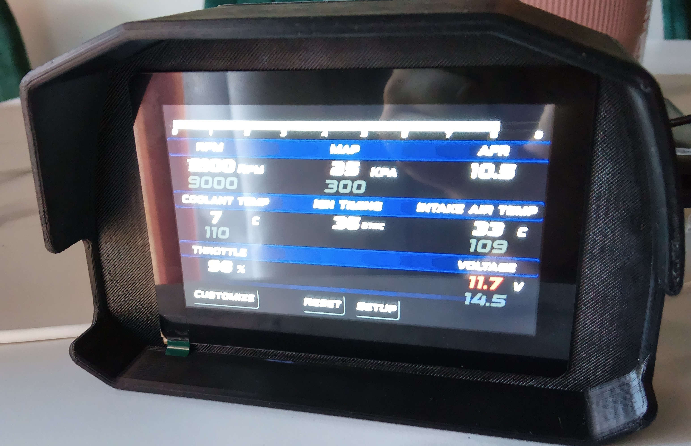

# Megasquirt / Microsquirt Digital LCD Dashboard - DIY under $50

A low-cost digital racing dashboard solution for Megasquirt and Microsquirt ECUs using an ESP32-S3 LCD display.

  

Premium licensed version + 3d Printed ABS Cluster:

  

## Introduction

Have you ever looked at modern racing LCD dashboards and thought:

*"I wish I could afford one..."*

Professional motorsport dashboards are amazing, but they are often extremely expensive.

This project was created to provide a cheap and reliable alternative:
a fully functional digital dashboard capable of displaying ECU data without carrying a laptop around.

After years of testing, development, and many prototype boards, this solution has evolved into a stable system currently running on **20+ cars**.

The firmware has been tested extensively and is currently considered reliable and bug-free.

---

# Demo Video

Free version demonstration:

https://youtu.be/rjETbBOaq9w

The video shows the dashboard receiving simulated CAN Bus data.

---

# Hardware Required

You need:

- ESP32-S3 5 inch LCD Touch Display
- USB Type-C data cable
- Megasquirt / Microsquirt ECU

Recommended display:

Waveshare ESP32-S3 Touch LCD 5 inch (800x480)

If you prefer 7 Inch LCD, Check the following git:

https://github.com/somahex00-web/Megasquirt-Microsquirt-7-LCD-digital-dashboard-for-under-50-DIY-

Purchase link:

https://www.waveshare.com/esp32-s3-touch-lcd-5.htm?&aff_id=155489

(If you use my link, it helps support the project development.)

---

# Installing the Free Firmware

## 1. Download Firmware

Download the free firmware:

https://github.com/somahex00-web/Megasquirt-Microsquirt-digital-dashboard-for-under-50-DIY/blob/main/Dash_Micro_LCD5_Free.bin

---

## 2. Connect the Display

Connect the ESP32-S3 display to your PC using a USB Type-C data cable.

---

## 3. Flash the Firmware

Open:

https://esptool.spacehuhn.com/

Select your ESP32 device from the available COM ports.

The board should be easily recognizable among COM devices, if it doesn't show up or it doesnt connect:

1. Hold the BOOT button
2. Press and hold RESET
3. Keep both pressed for ~2 seconds
4. Release RESET
5. Wait 1 second
6. Release BOOT

The device should now connect.

## 4. Flash Address

When asked for the firmware file:

Select:

LCD_DASH_5Inch_FREE.bin

Flash it at:

0x0000

A complete visual guide is available here:

https://github.com/somahex00-web/Megasquirt-Microsquirt-digital-dashboard-for-under-50-DIY/blob/main/How%20to%20flash.pdf

After flashing:

- Press RESET
or
- Disconnect and reconnect USB

The dashboard should boot.

---

# CAN Bus Termination

Important:

On the back of the display board there is a CAN Bus termination resistor selector.

If your CAN network only contains:

ECU + Dashboard

you should enable the termination resistor.

If you have multiple CAN devices:

Check the resistance between CAN-H and CAN-L using a multimeter.

Expected values:

60 Ohm → Correct termination, you don't need to switch the ESP32 termination switch behind.
120 Ohm → Missing second termination, you should enable the termination resistor switch behind the ESP32.

---

# Microsquirt Wiring

Installation guide:

https://github.com/somahex00-web/Megasquirt-Microsquirt-digital-dashboard-for-under-50-DIY/blob/main/Dashboard%20for%20microsquirt%20installation%20guide%20-%205%20inch%20dash%20ENG%20161025.pdf

---

# Features

- CAN Bus ECU communication
- Megasquirt / Microsquirt compatibility
- Custom racing dashboard graphics
- Multiple backgrounds
- Touch interface
- Standalone operation
- No laptop required
- Low-cost hardware

More graphics and premium layouts:

YouTube channel:

https://www.youtube.com/@alfredodimatteo2850

Example of a newer dashboard version:

https://www.youtube.com/watch?v=xfOAbD9B4jw

---

# Dashboard Gallery
example of licensed version design:

  

  

Many others available.

---

# Available Backgrounds

Catalogue:

https://github.com/somahex00-web/Megasquirt-Microsquirt-digital-dashboard-for-under-50-DIY/blob/main/Catalogue.pdf

---

# Premium License

The free version allows testing the hardware and basic dashboard functions.

The premium firmware license costs:

75 Euro

You also get the following 3d file ready to print:

https://cults3d.com/en/3d-model/gadget/waveshare-esp32-s3-5inch-display-dashboard-case

  

This contribution supports:

- New dashboard designs
- Hardware development
- New tools
- Future improvements

---

# How to Purchase

1. Flash the free version first
2. Open the dashboard
3. Click the bottom-right corner of the screen
4. Copy your unique license code

Send the license code through:

https://somahex00.wixsite.com/home/contact

You will receive a custom firmware file created specifically for your board.

Each license is hardware-bound and cannot be transferred to another device.

---

# Support

For updates, new graphics and development:

YouTube:
https://www.youtube.com/@alfredodimatteo2850

---

Made with passion for DIY motorsport projects.
